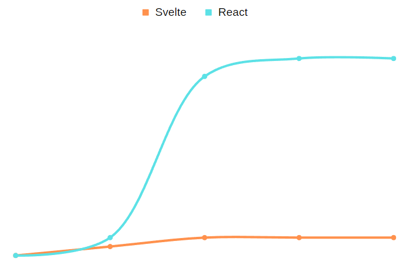

Frontend developers are expected to create beautiful, rich, accessible, and smooth user experiences. These expectations come with their fair share of issues. The biggest one is complexity: a large web app can be tens or hundreds of thousands of lines of code. Managing this complexity is a huge burden, which is amplified by the nature of the web, being ever-changing and requiring each developer to think a lot about which web browser features they are even allowed to use in order to support the maximum number of users.

In recent years, there has been a movement towards improving developer experience (DX) in hopes of lessening that burden. Various tools have attempted to solve DX by making it easier to manipulate web pages through creating, deleting, and updating HTML elements, such as buttons, inputs, and text. Web browsers use a representation of HTML called the document object model (DOM), which is a tree-like structure that can be manipulated by JavaScript (JS) code in order to dynamically update web pages after they’ve been loaded.

These tools are called JS frameworks, and they work by abstracting away the DOM manipulation code, in a way similar to how the C programming language abstracts away Assembly, or how what-you-see-is-what-you-get (WYSIWYG) editors like Microsoft Word abstract away the formatting information of rich text documents.

The basic idea is to give the developer the ability to create DOM nodes, and update them after any of the following events happen:

- A user interacts with the page
- A network request finishes
- A timer fires a tick

The methods these frameworks use for this abstraction are varied, but there are two popular approaches:

- Using a virtual DOM (VDOM) and diffing
- Using fine-grained reactivity

### VDOM + diffing

VDOM + diffing works by making the developer work with "fake" or "synthetic" versions of DOM nodes, which are much faster to build and update than the real DOM.

After the developer updates the VDOM, the result is compared against the previous version of itself, through a process known as diffing, in which the framework tries to find the minimal set of operations required to apply the updates to the real DOM. This can drastically reduce the amount of work that the browser has to do in order to update the page.

Or, that's the idea, at least. In practice, the amount of work done is actually drastically increased, due to:

- Keeping the VDOM in sync with the real DOM
- Discarding and re-creating large chunks of the VDOM
- Running a lot of complex rendering code very often

Frameworks which use the VDOM + diffing approach can often be seen creating a lot of temporary objects. This causes a lot of unnecessary garbage collector (GC) pressure, because the GC has to do more work in order to reclaim the memory used for those temporary objects.

Here’s what a typical initial render of something like Jira’s project board looks like in the Chrome DevTools profiler:


Those two GC cycles alone took nearly 100ms, and this screenshot shows only a tiny fraction of the 6s it took to finish the initial render. The minor GC is responsible for collecting those “quickly discarded” objects, such as the re-rendered parts of the VDOM, or all of the closures and dependency arrays created inside of functional components. The fact that it takes this long goes to show just how many objects the application is creating and immediately throwing away. This may cause the application to feel slow, unresponsive, or janky.

In essence, using a VDOM + diffing is a very brute-force approach to building UIs (tear the whole thing down and rebuild it from scratch any time anything changes). The trade-off is that it's much easier to reason about... Or is it? Introducing fine-grained reactivity.

### Fine-grained reactivity

For a long time, this was the de facto standard method for developing web applications, using frameworks like jQuery, Knockout.js, or even just plain JS without a framework. It works by creating and updating real DOM nodes, but at a very fine-grained level. What this means is that you "surgically" update only the parts of the DOM which are affected by any events only when those events fire, instead of "throwing away" large parts of the DOM (or VDOM), and re-rendering those parts from scratch.

One often-cited problem with fine-grained reactivity is how verbose it is. That is indeed true - VDOM code and "raw" JS DOM manipulation code are night and day in terms of brevity, especially when the former is used with a syntactic superset of HTML and JS called JSX.

It's also simply a lot harder to write code using this method, because it doesn't cleanly map to how people usually visualize their app’s tree of HTML elements. You'll have tons of loose, often duplicated, very verbose code strewn about in various event listener callbacks or random functions, and some at the top-level, making it harder to understand what is actually happening.

To give a concrete example, below is the code for a simple app which has a single text input, and a single text node. The text node's contents are kept in sync with the input.

Here's what it would look like in plain JS:

```ts
const text = document.createElement("span");

const input = document.createElement("input");
input.type = "text";
input.addEventListener("input", () => (text.textContent = input.value));

document.body.appendChild(input);
document.body.appendChild(text);
```

This code lacks structure, and there isn't a good way to improve it. As your app grows, it would very quickly become unmaintainable. This is what it would look like in React:

```jsx
function App() {
  const [value, setValue] = useState("");

  return (
    <>
      <input type="text" onInput={(event) => setValue(event.target.value)} />
      <span>{value}</span>
    </>
  );
}
```

It looks like HTML with a bit of JS thrown in, but the structure is clear. In this model, it's very easy to abstract away parts of your app, such as custom inputs, buttons, tables, etc. React is a clear winner here, and this is one of the main reasons for its popularity.

However, React uses the VDOM + diffing approach, and the aforementioned problems still exist. Every time you type a character into the input, React has to re-run the entire body of the `App` function - which means recreating the top-level fragment (`<>...</>`) element, the `input` and `span`, the `onInput` callback, and the temporary array returned from `useState`. After doing all of that work, it will perform a diff and realise that only the content of the `span` need to be updated, and it will discard everything else.

There are a lot of rules that you have to keep in mind when writing code in something like React, and these rules are "made up" in the sense that they are simply attempting to solve problems which React created (in particular, the re-rendering problem). There are a lot of concepts that you have to understand in order to be productive in React, such as synthetic events, memoization, hook dependencies, effects... The list goes on.

As your app grows, it is certainly more maintainable than plain JS code, but you are paying a huge price in performance which you have to spend a lot of time and effort optimizing, and eventually also in the cognitive load of understanding any complex apps written this way. The plain JS code does not have those performance problems, as the only work it does is update the `textContent` value of the span each time you type a character into the input. It does not create any temporary objects, and it doesn't perform an often expensive diff.

See for example the [js-framework-benchmark](https://krausest.github.io/js-framework-benchmark/current.html), and select `vanillajs` and `React` under the `Which frameworks` dropdown. Disclaimer: It is a microbenchmark, and it does _not_ tell the full story of how those frameworks behave in the real world, but it does show one part of it, so it remains a useful indicator.

While the plain JS example is (almost) as close as you can get to peak performance, it is extremely verbose, so there is no way anyone could use it in large, complex apps, and remain productive... But what if we could have our cake and eat it too?

### Introducing Svelte

```svelte
<script>
  let value = ''
</script>

<input
  type="text"
  on:input={(event) => value = event.target.value}
/>
<span>{value}</span>
```

This works the exact same way as the previous two examples. It looks similar to React, except that our markup is no longer wrapped in a function, and we have a new `script` tag with a single variable inside of it. Each time we assign a new value to `value`, the `span` element's contents will update. It is performing basically the exact same work as the plain JS example, but it is as terse as the React example.

Svelte does not use a VDOM, and instead employs a compiler. The compiler converts the above code into what is in essence the equivalent of the plain JS example. When the component is rendered for the first time, the "body" of that script runs once, and never again. Assigning to a variable will cause that variable to be "invalidated", which will cause all of its dependents to update - in this case, that's the `span` element.

Here's a talk by Rich Harris (Svelte's creator) that delves a bit further into these ideas: [Rich Harris - Rethinking reactivity](https://www.youtube.com/watch?v=AdNJ3fydeao)

The result is that Svelte gets to keep all the good parts of React, and none of its drawbacks. In my personal experience, after using both for a long time, the learning curves of Svelte and React look something like this:



React starts out simple, but quickly gets more complex as you have to learn about all of the concepts it introduces in order to satisfy the more advanced use-cases.

Svelte starts simple, and stays simple. This doesn’t mean it can’t satisfy those same advanced use-cases - it’s the opposite, in fact.

Let’s look at a different, slightly more complex example. We’ll create a counter, and then display the [factorial](https://en.wikipedia.org/wiki/Factorial) of the counter’s value:

```jsx
function FactorialCounter() {
  const [number, setNumber] = useState(0);
  const factorial = calculateFactorial(number);

  return (
    <>
      <button onClick={() => setNumber(number + 1)}>+</button>
      <button onClick={() => setNumber(number - 1)}>-</button>
      <pre>
        {number}! = {factorial}
      </pre>
    </>
  );
}
```

Whenever the value changes, the factorial is re-calculated. Looks good… but if we put this component inside our `<App />` in the previous example, we’ll find that it re-renders every time `App` re-renders. This may not be a problem at first, but as you keep increasing the value of the counter, the calculation becomes more and more expensive. At some point a single re-render of the `App` component can cause a noticeable stutter, even though it may not even result in a visible difference.

The problem is solved using memoization:

```jsx
function FactorialCounter() {
  const [number, setNumber] = useState(0);
  const factorial = useMemo(() => calculateFactorial(number), [number]);

  return (
    <>
      <button onClick={() => setNumber(number + 1)}>+</button>
      <button onClick={() => setNumber(number - 1)}>-</button>
      <pre>
        {number}! = {factorial}
      </pre>
    </>
  );
}
```

Now the `factorial` will only be re-calculated whenever `number` changes, which means that re-renders of `App` will not cause it to run that potentially expensive calculation. This is a very common problem, but it isn’t unique to React, right?

While it’s true that Svelte can’t help you calculate a factorial faster, it instead takes a different approach to solving the problem, one that requires significantly less work from the developer. Here’s how the memoized example would look like in Svelte:

```svelte
<script>
  let number = 0
  $: factorial = calculateFactorial(number)
</script>

<button on:click={() => number += 1}>+</button>
<button on:click={() => number -= 1}>-</button>
<pre>{number}! = {factorial}</pre>
```

The `$:` syntax is [valid JavaScript](https://developer.mozilla.org/en-US/docs/Web/JavaScript/Reference/Statements/label), which Svelte re-purposes for creating [reactive statements](https://svelte.dev/tutorial/reactive-declarations). Notice that there is no dependency array. Instead of memoization, Svelte uses the concept of _derived state_. Where in React you have to explicitly think about what `factorial` depends on, which you can easily get wrong (and ruin your app’s performance), Svelte updates the value of `factorial` for you whenever any of the reactive values it depends on change. `number` is already reactive (as we can see in the example with a single input), so changing it will trigger an update to `factorial`. It’s almost as if Svelte gives you memoization for free.

You can play around with the Svelte code [in the REPL](https://svelte.dev/repl/a12856781550455f8ac24594da2ec42f?version=3.48.0).

At this point I’d recommend going through the [official Svelte tutorial](https://svelte.dev/tutorial/basics), which introduces every single feature of Svelte, but takes less than 30 minutes to get through. I strongly believe that Svelte's learning curve in the graph above will make a lot more sense once you try it out.

### Ecosystem

React can’t do some of the things that Svelte can do out of the box, such as complex transitions, scoped styles, and global data stores. React not including this functionality in its core is both a blessing and a curse, as by providing only the bare minimum, it becomes very flexible, but in return, it forces developers to use a lot of third-party libraries. These libraries have to be kept up-to-date as React itself updates, but you’re often blocked from using the latest and greatest of React as you wait for your dependencies to release a new version.

That’s the apparent trade-off: By using more dependencies, you’re increasing the maintenance burden, but you’re able to swap the dependencies out for other ones as you see fit… But do you really have to accept this trade-off? What if React included this functionality in its core, but still allowed you to swap them out as you see fit?

This is exactly how Svelte works. It is also very minimal in its core, but it comes with a few “built-in” packages to make your life easier. They aren’t separate dependencies, so they also don’t need to be kept up to date separately. You can still swap them out as you see fit. Svelte is a fully featured, batteries-included, but also very unopinionated framework.

Speaking of third-party libraries… Svelte is not nearly as popular as React, which means its ecosystem of libraries and tools is also going to be smaller. But how small is it, really? Is it even viable? Let’s look at some of the tools and libraries we use in React day-to-day, and see if Svelte has an equivalent, or if we’re out of luck:

- Build - Svelte plugins exist for every build tool in existence.
- Devtools - [svelte-devtools](https://github.com/RedHatter/svelte-devtools) is unmaintained and broken, but there is a [pull request](https://github.com/RedHatter/svelte-devtools/pull/70) with a (+1/-1) fix that people are reporting success on. We can fork it, merge the PR, and continue using it.
- Routing - There are many solutions here, such as [svelte-navigator](https://github.com/mefechoel/svelte-navigator), [svelte-spa-router](https://github.com/ItalyPaleAle/svelte-spa-router), and the meta-framework developed by the Svelte core team, [SvelteKit](https://kit.svelte.dev/), which uses Next.js-like filesystem-based routing.
- Tables - [svelte-table](https://github.com/dasDaniel/svelte-table) exists, and it's probably a little too basic for advanced use-cases, because it doesn't support virtualization. For that, there's [svelte-tiny-virtual-list](https://github.com/skayo/svelte-tiny-virtual-list).
- Selects - [svelte-select](https://github.com/rob-balfre/svelte-select) probably has all the functionality you could need, and is well maintained.
- Icons - [svelte-fontawesome](https://github.com/yukipastelcat/svelte-fontawesome) or [svelte-fa](https://github.com/Cweili/svelte-fa) for FontAwesome, [svelte-material-icons](https://github.com/jprochazk/svelte-material-icons) for Material (disclaimer: my own library), and much more. You can easily find a wrapper for your favorite set of icons as the top result on Google.
- Component libraries - there are plenty of options, such as (but not limited to) [sveltestrap](https://github.com/bestguy/sveltestrap) (Bootstrap), [svelte-material-ui](https://github.com/hperrin/svelte-material-ui) (Material UI), or [carbon-components-svelte](https://github.com/carbon-design-system/carbon-components-svelte) (IBM’s Carbon), and many more.
- Code editors - these are generally framework-agnostic (codemirror, monaco, ace), and easy to wrap up in your own component.

I also recommend checking out [awesome-svelte](https://github.com/TheComputerM/awesome-svelte). All in all, there are some rough edges, but it’s more than usable.

What about hiring potential? Are there enough Svelte devs available for hire? Well, if you're a fully remote company hiring in any US or EU timezone, you will have absolutely no problem finding candidates. Checkout `#jobs` in the [official Discord server](https://t.co/bDvUqAxQmS) and [sveltejobs.dev](https://sveltejobs.dev/). You can also try to look for communities for your specific language where Svelte devs congregate, for my country (Czechia), that'd be the [CZ/SK community Discord server](https://discord.gg/RhwVpaSDPk).

Note that you don't actually have to hire _Svelte_ devs - you can just hire _web_ devs, and teach them Svelte! Because Svelte has no crazy gotchas that only seasoned developers are capable of avoiding, it's a viable approach, and will allow you to cast a much wider net for potential hires.

### Conclusion

While it _is_ true that I am biased (because I love Svelte), I didn't mention any downsides because I had a hard time finding any. Let's instead take a look at some of the most common criticisms of Svelte:

> It's too magical.

And React isn't? Why don’t people find it strange that your functions re-run automatically, when in non-React code (which is the majority of all code) they only run when you call them, or explicitly attach them to some event or timeout? Or that you can pull state out of thin air in a function’s local scope, [except for when you can't](https://reactjs.org/docs/hooks-rules.html)? In comparison to the magic of React, Svelte is as straightforward as it gets. It [compiles to somewhat readable JavaScript](https://svelte.dev/repl/a12856781550455f8ac24594da2ec42f?version=3.48.0) (available under the `JS output` tab on the right), and the behavior becomes clear after a bit of twiddling around.

> It doesn't scale.

It does. There are tech giants using it successfully, such as [IBM](https://github.com/carbon-design-system/carbon-components-svelte), or [Square](https://twitter.com/sveltesociety/status/1410259330998341636?lang=en).

There is an actual point to be made here, though. Svelte seems to have some problems [scaling in bundle size](https://github.com/sveltejs/svelte/issues/2546) - it starts out very small, just under 5kB for a hello-world app due to not bundling a large runtime (compared to React at nearly 50kB), but the compiled output of Svelte components is generally a little bit larger than that of React components, so at some point, you’ll end up with a larger total bundle size than you’d have with a React app. Putting your entire app into a single bundle is almost never a good idea, so this isn’t a problem in practice thanks to code splitting.

That being said, the Svelte developers have taken the concerns of the community into account, and [have some ideas in store](https://youtu.be/uQntFkK8Z54?t=1020) for the next iteration of Svelte that would end up removing the issue completely. As a side note, I think this speaks volumes about how Svelte is truly community-driven, which is an excellent property to have.

> It's too immature.

It was probably good enough to use the moment it [introduced TypeScript support back in July 2020](https://svelte.dev/blog/svelte-and-typescript). Rich Harris (Svelte’s creator) was recently [hired by Vercel](https://vercel.com/blog/vercel-welcomes-rich-harris-creator-of-svelte) to work on it full time, so the framework has a solid foundation, and solid backing. It is sufficiently mature now, and I hope I've made a good enough case for why.

Of course, many alternative frameworks exist, and some of them are really nice:

- [Inferno](https://www.infernojs.org/) is an excellent implementation of the VDOM + diffing approach, and does great in benchmarks, but its adherence to React compatibility means it has the same usability problems as React.
- [Lit](https://lit.dev/) goes in a completely different direction and makes it easy to build [Web Components](https://developer.mozilla.org/en-US/docs/Web/Web_Components), which have the benefit of being (almost) framework-agnostic.
- [Solid](https://www.solidjs.com/) takes the fine-grained reactivity approach to the extreme. It’s still fairly young, and the ecosystem is small, otherwise it’d probably end up being the top choice.

All things considered, Svelte still wins in my book. It has the perfect combination of performance, usability, stability, and maturity.

I hope I’ve illustrated the benefits of Svelte well enough to make it worth considering. If you haven't already, I urge you to check out the [Svelte tutorial](https://svelte.dev/tutorial/basics).
